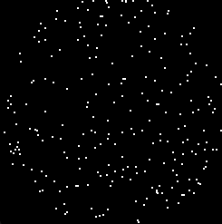

# gym-rdm

A [Gymnasium](https://gymnasium.farama.org/) environment for training agents on Random Dot Motion tasks.

## About

The project uses [pygame](https://www.pygame.org) to animate a set of dots in a more or less random fashion, implementing a Random Dot Kinematogram (RDK) psychophysics task.



The previous demo was generated by the following command.

```bash
# Run the task unit tests as a standalone python program
python tests/test_task.py
```

## Development notes

### Toolchain

This project is built and tested with the following software:

- [Poetry](https://python-poetry.org/) for dependency management and packaging;
- [Black](https://github.com/psf/black) for code formatting;
- [Pylint](https://github.com/pylint-dev/pylint) and [mypy](http://mypy-lang.org/) to detect defaults and mistakes in the code;
- [pytest](https://docs.pytest.org) for testing the code.

### Useful commands

```bash
# Reformat all Python files
black gym_rdm tests

# Check the code for mistakes
pylint gym_rdm tests

# Run all code examples as unit tests
# The -s flag prints code output
pytest [-s]

# Run static type checking
# The -strict flag is... stricter. It should pass on the codebase
mypy [--strict] .
```

## License

[MIT](CODE_LICENSE).

Copyright © 2024-present [Baptiste Pesquet](https://bpesquet.fr).
